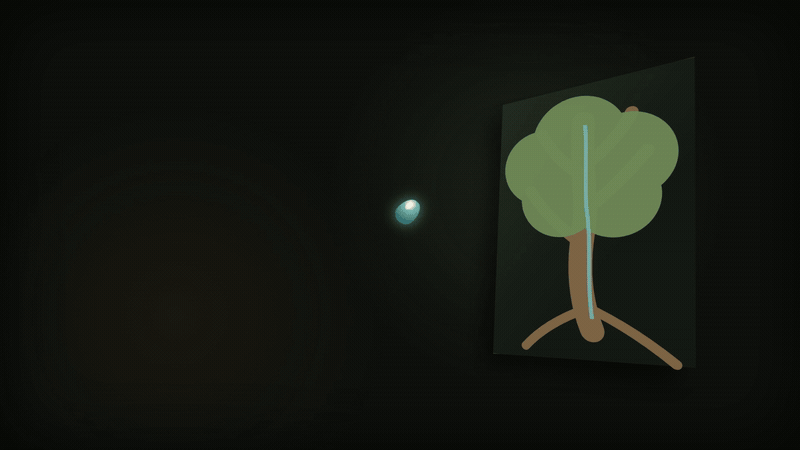

# BetterEdit

An open-source video editing skill for Codex. One install, 240 motion templates you can actually preview

BetterEdit started as my own editing rulebook. I wanted Codex to remember how I structure a hook, when a shot should move, where sound cues belong, and which visual habits I never want to see again. Copying all of that into every task got old very quickly, so I turned it into a skill.

Give it a topic, script, voiceover, footage, stills or audio. It helps plan the edit, choose real templates from the bundled library, bind your material to them, then render with the video tools already available on your machine.

It is opinionated on purpose. Serif type. Strong continuity. Useful depth and slanted planes. No decorative UI clutter just because the frame felt empty

BetterEdit is an independent community project. It is not affiliated with or endorsed by OpenAI.

## One finished example

**No Pump. Still Rising.** is a 30-second explanation of how a tree pulls water upward without a mechanical pump. It uses the same rules bundled with BetterEdit: serif titles, narrated sound design, oblique planes, a perspective corridor, continuous focal travel and a final spatial payoff.

<a href="docs/media/no-pump-still-rising-30s.mp4?raw=1"></a>

Click the moving preview for the complete 30-second MP4. Sound on

## Install

Ask Codex:

> Install the BetterEdit skill from `https://github.com/huynhminhhoang240302-sudo/betteredit/tree/main/skill/betteredit`

Restart Codex, then try something like:

> Use $betteredit to make a 30-second highlight about solar storms. Render an MP4, keep the type serif, and use meaningful oblique 2.5D scenes.

That is the whole BetterEdit install. No second prompt pack, plugin, API key or cloud account.

To render a new MP4, your machine still needs a video encoder such as FFmpeg. The guide, browser, template selection and all included previews work without installing another BetterEdit component.

Manual install: copy `skill/betteredit` into `$CODEX_HOME/skills/betteredit`, then restart Codex.

## What you get

- 240 short-edit templates across 32 narrative families
- 240 playable 960x540 MP4 previews with guide audio
- an offline browser for searching and auditioning the library
- frontal, yaw, tilt, corridor, depth-stack, oblique-split and orbital compositions
- 204 spatial/non-frontal examples, plus 36 frontal resets where a flat view is actually clearer
- schemas, selectors, asset bindings and validation tools
- the full workflow: story, continuity, 2.5D/3D staging, sound, render and QA

The previews are generic choreography demonstrations. They are not stock footage and they are not supposed to become the final edit untouched. Pick a structure, bring your own cleared material, then let BetterEdit fit the two together.

## The visual rules

These came from the original project and stay locked unless the maintainer changes them:

- designed typography uses serif fonts
- no decorative notes stuck along the top or bottom edge
- no repeated diagonal stripe, hatch or crossed-line wallpaper
- no slash-style fake wayfinding counters
- no tiny label plus detached underline pretending to be a design system

Slanted composition is allowed. Encouraged, really. A tilted card, perspective screen, architectural cutaway, route, chart or mechanism is useful when it explains something. The rule above is about decorative line fields, not about making every shot flat.

## A few things BetterEdit is not

It is not a cloud video generator. It does not upload your footage somewhere, and it does not need your browser profile, credentials or home directory.

It is not a promise that one click makes a good film. You still choose the story and approve the material. BetterEdit gives Codex a much better editing vocabulary and a repeatable way to use it.

And it is not finished. This is a public beta. If a clean install breaks, a template feels repetitive, or the instructions produce a weak edit, please open an issue and show the actual result.

## Privacy and safety

The template browser is static and makes no network requests. Keep source media in the video project, outside the installed skill. BetterEdit only writes project outputs where the task tells it to.

No private source footage, credentials or workstation paths belong in this repository. The public-package audit checks for those before a release.

More detail: [SECURITY.md](SECURITY.md), [PRIVACY.md](PRIVACY.md) and the [threat model](docs/THREAT_MODEL.md).

## Working on the repository

You need Node.js 20 or newer. FFmpeg and FFprobe are only needed when regenerating previews or running deep media checks.

```bash
git clone https://github.com/huynhminhhoang240302-sudo/betteredit.git
cd betteredit
node tools/validate-library.mjs
node tools/audit-public-package.mjs
```

Check the installable skill itself:

```bash
node skill/betteredit/scripts/doctor.mjs
node skill/betteredit/scripts/validate-library.mjs
node skill/betteredit/scripts/find-templates.mjs --spatial corridor --effort enhanced
```

The useful folders:

```text
skill/betteredit/                         the thing users install
skill/betteredit/SKILL.md                 the agent workflow
skill/betteredit/assets/template-library/ templates, previews, schemas and browser
skill/betteredit/references/              guide, field card and safety notes
skill/betteredit/scripts/                 local tools used by the skill
library/ previews/ schema/                maintainer-side source mirrors
docs/                                     architecture and maintenance records
```

The root `template-browser.html` is the maintainer copy. Installed users open the version bundled under `skill/betteredit/assets/template-library/`.

## How an edit is put together

BetterEdit keeps reusable motion separate from private media:

1. The skill reads the brief and builds an edit plan
2. A choreography template supplies timing, focal movement, spatial layout, sound events and asset slots
3. A style definition supplies type, color, surfaces, light and motion behavior
4. A project-local binding connects approved files to those slots
5. The renderer turns the plan into source files and a real MP4

That separation is important. The public library can be reused without absorbing anyone's footage into the skill.

## Status

[`v0.1.2`](https://github.com/huynhminhhoang240302-sudo/betteredit/releases/tag/v0.1.2) is the current beta.

Right now the useful work is less glamorous: clean-install reports, real examples, bug reports, review, and seeing whether the system holds up outside my machine. The [roadmap](ROADMAP.md) and [application plan](APPLICATION_PLAN.md) track that work openly.

## Contributing

Start with [CONTRIBUTING.md](CONTRIBUTING.md). A new template needs to be visually distinct, deterministic, schema-valid and accompanied by a playable preview. Please do not submit private footage or a slightly renamed copy of an existing motion.

Questions and rough experiments are welcome too. An issue with a screen recording is often more useful than a polished paragraph

## License

MIT. See [LICENSE](LICENSE).
